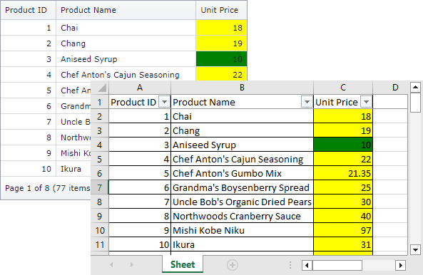

<!-- default badges list -->

[](https://supportcenter.devexpress.com/ticket/details/E4098)
[](https://docs.devexpress.com/GeneralInformation/403183)
[](#does-this-example-address-your-development-requirementsobjectives)
<!-- default badges end -->


# Grid View for MVC - How to export a colored grid in Data Aware export mode

This example shows how to color the exported grid when Data Aware export mode is used.



The grid does not export cell styles applied in the [HtmlDataCellPrepared](https://docs.devexpress.com/AspNetMvc/DevExpress.Web.Mvc.GridViewSettings.HtmlDataCellPrepared) event. 

To color the exported grid in Data Aware export mode, handle the [XlsxExportOptionsEx.CustomizeCell](https://docs.devexpress.com/CoreLibraries/DevExpress.XtraPrinting.XlsxExportOptionsEx.CustomizeCell) event.

```cs
public ActionResult ExportTo() {
    XlsxExportOptionsEx exportOptions = new XlsxExportOptionsEx();
    exportOptions.CustomizeCell += new DevExpress.Export.CustomizeCellEventHandler(exportOptions_CustomizeCell);
    return GridViewExtension.ExportToXlsx(GridViewHelper.ExportGridViewSettings, MyModel.GetProducts(), exportOptions);
}
void exportOptions_CustomizeCell(DevExpress.Export.CustomizeCellEventArgs ea) {
    if(ea.AreaType != DevExpress.Export.SheetAreaType.Header && ea.ColumnFieldName == "UnitPrice") {
        if(Convert.ToDecimal(ea.Value) > 15)
            ea.Formatting.BackColor = System.Drawing.Color.Yellow;
        else
            ea.Formatting.BackColor = System.Drawing.Color.Green;
        ea.Handled = true;
    }
}
```


> **Note**  
> Starting from v15.2, the grid maintains conditional formatting styles in the exported document. You can use the [GridViewSettings.FormatConditions](https://docs.devexpress.com/AspNetMvc/DevExpress.Web.Mvc.GridViewSettings-1.FormatConditions) rules to define conditional formatting in browse mode and keep the applied appearance in the exported document.
## Files to Review

* [HomeController.cs](./CS/Controllers/HomeController.cs#L28-L36) (VB: [HomeController.vb](./VB/Controllers/HomeController.vb))
* [Model.cs](./CS/Models/Model.cs) (VB: [Model.vb](./VB/Models/Model.vb))
* [GridViewPartialProducts.cshtml](./CS/Views/Home/GridViewPartialProducts.cshtml)
* [Index.cshtml](./CS/Views/Home/Index.cshtml)

## Documentation

* [Export Grid View Data](https://docs.devexpress.com/AspNet/3791/components/grid-view/concepts/export)

## Technical Demos

* [Grid View - Export with Format Conditions](https://demos.devexpress.com/MVCxGridViewDemos/Exporting/ExportWithFormatConditions)
## More Examples

* [Grid View for MVC - How to export a colored grid in WYSIWYG export mode](https://github.com/DevExpress-Examples/asp-net-mvc-grid-export-colored-grid-in-wysiwyg-mode)
* [Grid View for Web Forms - How to export a colored grid in Data Aware export mode](https://github.com/DevExpress-Examples/asp-net-web-forms-grid-export-colored-grid-in-data-aware-mode)
* [Grid View for Web Forms - How to export a colored grid in WYSIWYG export mode](https://github.com/DevExpress-Examples/asp-net-web-forms-grid-export-colored-grid-in-wysiwyg-mode)

<!-- feedback -->
## Does this example address your development requirements/objectives?

[](https://www.devexpress.com/support/examples/survey.xml?utm_source=github&utm_campaign=asp-net-mvc-grid-export-colored-grid-in-data-aware-mode&~~~was_helpful=yes) [](https://www.devexpress.com/support/examples/survey.xml?utm_source=github&utm_campaign=asp-net-mvc-grid-export-colored-grid-in-data-aware-mode&~~~was_helpful=no)

(you will be redirected to DevExpress.com to submit your response)
<!-- feedback end -->
